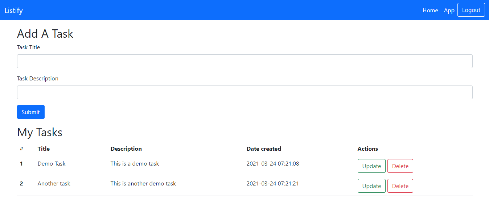

# Listify

### This is a todo list app that I have made with Flask.

## Live Deployment
### https://listify-todo.herokuapp.com/




## Usage
### 1/ Clone this repository using
```bash:
git clone git@github.com:manzumrahman/Listify.git
```

### 2/ make a .env file and put this following text there
```bash:
DATABASE_URL=sqlite:///database.db
```

### 3/ Run the following commands in terminal
 ```bash:
pip install -r requirements.txt
python app.py
```
### Done:Your website will be live on http://127.0.0.1:5000

## Contribute
### Make a pull request after fixing a bug or making your desired changes and put appropiate description about your changes , I will merge it if I find it useful.

#### Made with ❤ by Md.Manzum Rahman :)
